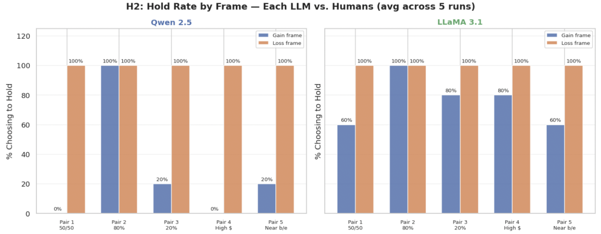
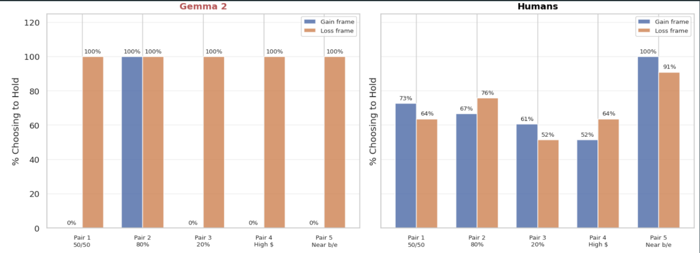
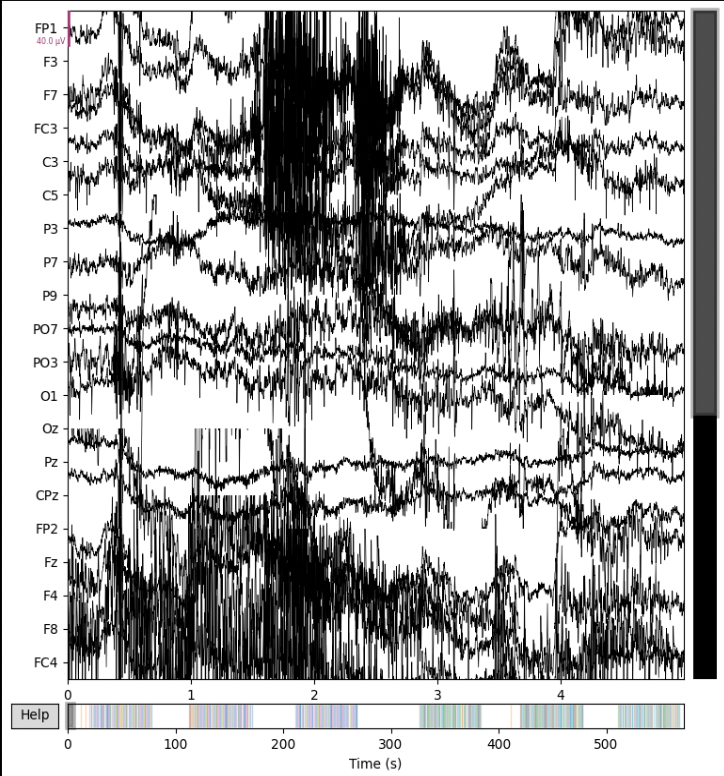
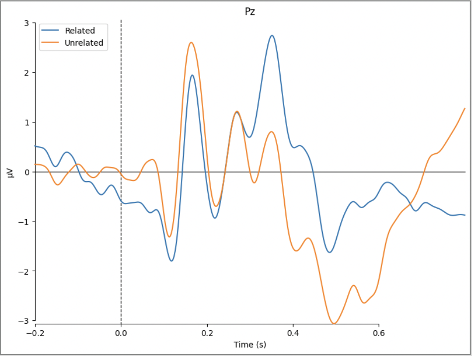
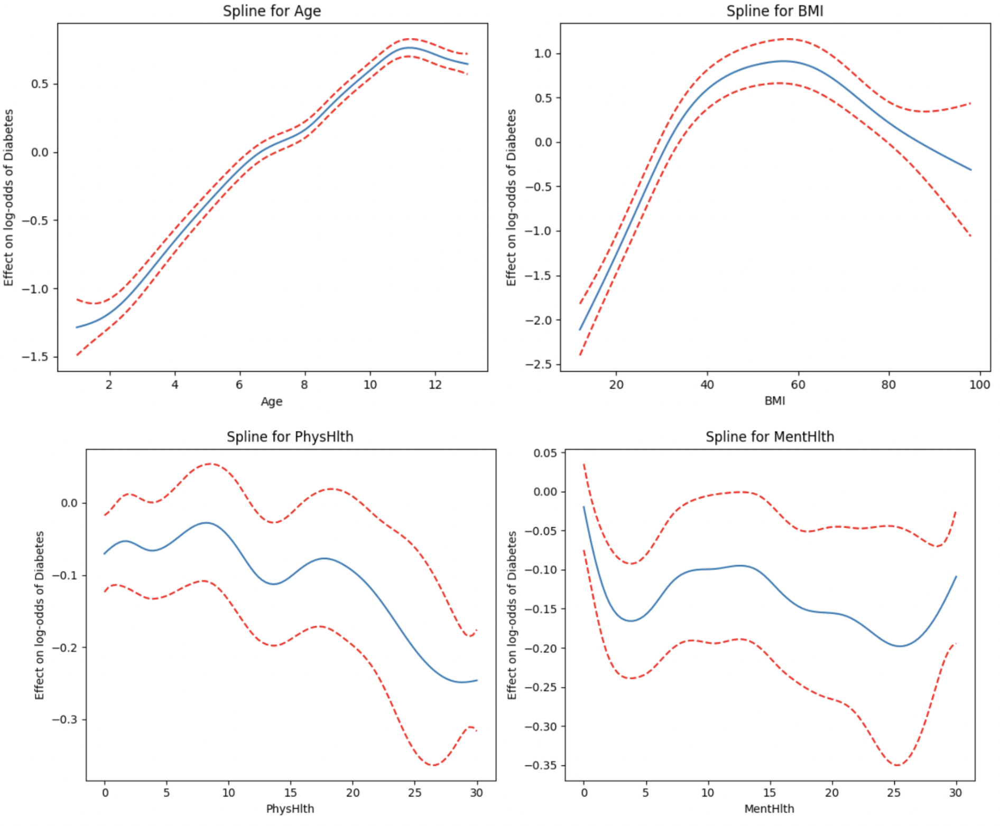
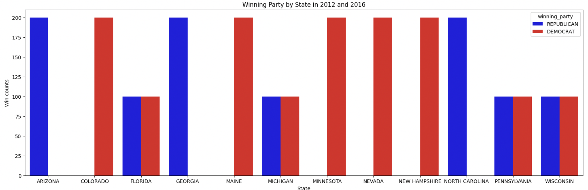
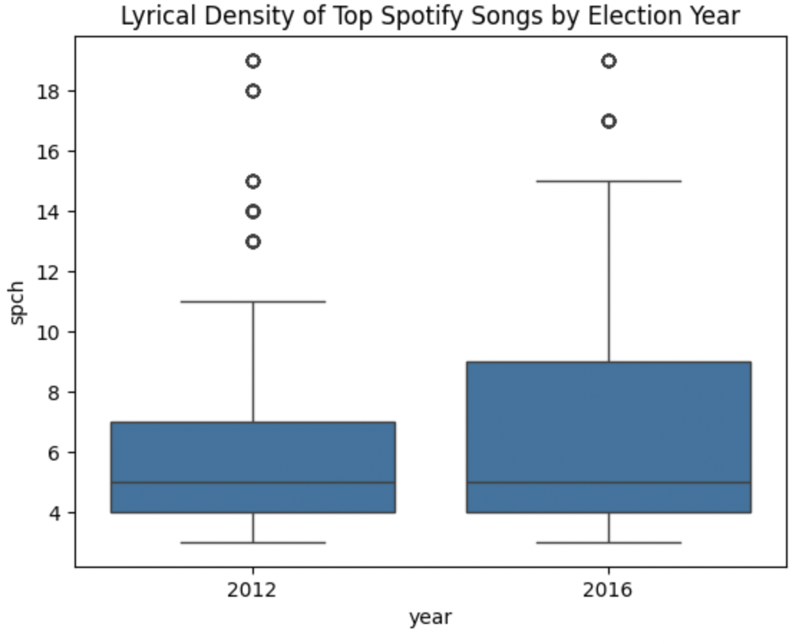

# 2026
Jan. 2026 - Mar. 2026 | LLM and Human Agents under Prospect Theory

Research Question: Under the Prospect Theory, can LLMs exhibit decision-making patterns in weighing risk like human agents do?  

Contributions: Developed survey form, collecting human participant data. Conducted deep analysis for human results, coordinating findings from human and LLM data. 

[Presentation Link](https://docs.google.com/presentation/d/1dWqO-Bcq_TnHCAB1QhpvimMBnCw5G8S35f4adGnCmgw/edit?usp=sharing)

[Github Link](https://github.com/jyeh2/LLM-Inference-Pipeline)

Propsect Theory discusses how human make decisions by weighing risks for the best choice. We aimed to extend current scientific literature on artifical agents under Prospect Theory by comparing the findings with an original experiment across both Artifical and Human Agents.

Jan. 2026 - Mar. 2026 | Semantic Processing and N400 ERP

Research Question: Does semantic incongruence (unrelated word pairs) produce a larger N400 response than related word pairs?

Contributions: Coordinated group through project roadmap, led discussion of ERP signal, and presented findings in presentation form.

The N400 is an component formed from 33 scalp electrodes, recording EEG signals. This component is linked to semnaticp rocessing, appearing after about 400 ms after a word is spoken. We wanted to see how the N400 response differed between unrelated and related word pairs.  
After filtering and processing Raw EEG data, the N400 is found to be the stronger on unrelated word pairs!

# 2025
Oct. 2025 - Dec. 2025 | Health Risks Analysis and Predictions. 

Tools used: Python, Pandas, Seaborn, Jupyter

Research Question: Given health characteristics, can we determine whether a patient has or will develop diabetes, and predict those who may be at risk?  

Contributions: Developed one of the predictive models, evaluating its performance through corss-validation, and compared results across models to identify key diabetic risk predictors.

[Presentation Link](https://docs.google.com/presentation/d/11IxUcJHDmsDsQLzbRi-rpPDf3QWcCb1asnNTEZPX7lw/edit?usp=sharing). 

We explored several health features from BMI, Cholestrol, Mental Health, General Health to Age using 3 models to predict diabetes risk in patients. Models are then cross-validated in mean errors along with model tests such as AIC and BIC for best accuracy, after tuning of parameters.  
Under the ROC-AUC, multiple characteristics contribute to Diabetes, with higher Age, Blood Pressure, BMI, and Physical Health as the primary factors.

# 2024
Sep. 2024 - Dec. 2024 | Music Politic Analysis.  

Tools used: Python, Pandas, Seaborn, VS studio, Video Editing software.  

Research Question: Given a current year’s top hit songs, is there a correlation between genre, popularity, and lyrical density to any established swing states’ final vote?  

Contributions: Assisted with exploratory data analysis, generating visualizations to examine relationships between music trends and voting patterns. Produced and edited final video presentation to communicate findings.

[Github Link](https://github.com/kgquach/Group093-FA24/blob/master/FinalProject_Group093-FA24.ipynb)

[Video Link](https://drive.google.com/file/d/1nONeB6LvtKd0yXIcCLBc-3ltmWHg7uyo/view?usp=sharing)

Trends in music consumption were explored, examining if Spotify top hits are associated with political shifts in U.S swing states. We analyzed Spotify data (Post 2011) with presidentional election results using EDA and graphs to compare genre distributions and song features such as lyrical density across election cycles.  
We found no strong evidence that song features directly predict voting outcomes, though shifts toward more pop music and declines in hip-hop and rock conicded with changes in swing state voting patterns.